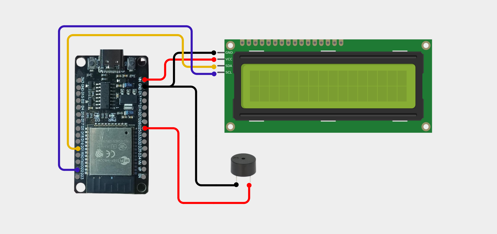
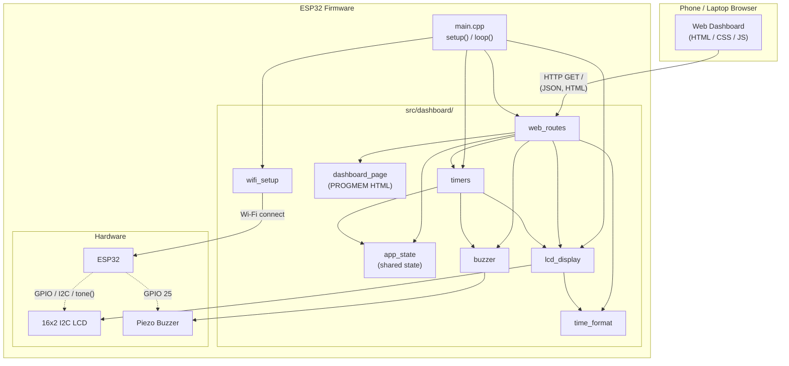

# ESP32 Pomodoro Timer Fa3

A multi-mode productivity timer on ESP32. Combines an LCD readout with a web dashboard you can open from any phone on the same Wi-Fi.

Three modes:

- **Pomodoro** — automatic 25 / 5 / 15 minute rotation with a long break every 4th cycle.
- **Custom Timer** — set any countdown up to 999 minutes 59 seconds.
- **Stopwatch** — counts up from zero.

A buzzer plays a short whistle when a session ends.



## Hardware

- ESP32 Dev Board
- 16x2 I2C LCD (address 0x27)
- Buzzer

## Wiring

| Signal | GPIO |
|---|---|
| I2C SDA | D21 |
| I2C SCL | D22 |
| I2C VCC | VIN |
| I2C GND | GND |
| Buzzer VCC | D25 |
| Buzzer GND | GND |

## Build & Upload

```bash
pio run -t upload
pio device monitor -b 115200
```

After Wi-Fi connects, the serial monitor prints the IP address. Open `http://<ip>/` in any browser on the same network.

## Project Structure

The firmware is split into focused modules under `src/dashboard/`. `src/main.cpp` only wires them together.

```
src/
├── main.cpp                            # setup() and loop() only
└── dashboard/
    ├── app_state.h / .cpp              # Shared state: modes, durations, timer vars, whistle
    ├── time_format.h / .cpp            # mm:ss / hh:mm:ss formatter
    ├── buzzer.h / .cpp                 # Football-whistle alert
    ├── lcd_display.h / .cpp            # 16x2 LCD rendering per mode
    ├── timers.h / .cpp                 # Pomodoro session cycle, tick logic
    ├── web_routes.h / .cpp             # HTTP routes + JSON status
    ├── dashboard_page.h                # Embedded HTML/CSS/JS (PROGMEM)
    └── wifi_setup.h / .cpp             # Wi-Fi credentials + connect()
```

## System Architecture



**How it flows:**

- `main.cpp` boots, calls `connectWiFi()`, then `setupRoutes()`, then enters the loop.
- The loop runs three things every tick: `server.handleClient()` (HTTP), `updateTimer()` (1-second tick), `updateBuzzer()` (whistle ramp).
- The browser talks to the ESP32 only through `web_routes` — `GET /` returns the dashboard HTML, `GET /status` returns JSON, the other routes change state.
- `web_routes` and `timers` share state through `app_state` rather than passing everything explicitly.

## Configuration

Wi-Fi credentials live in `src/dashboard/wifi_setup.cpp`:

```cpp
const char* WIFI_SSID = "YOUR-WIFI-SSID";
const char* WIFI_PASSWORD = "YOUR-WIFI-PASSWORD";
```

Pomodoro durations and pin definitions live in `src/dashboard/app_state.h` / `app_state.cpp`:

```cpp
const unsigned long FOCUS_SECONDS       = 25UL * 60UL;
const unsigned long SHORT_BREAK_SECONDS = 5UL  * 60UL;
const unsigned long LONG_BREAK_SECONDS  = 15UL * 60UL;

#define I2C_SDA     21
#define I2C_SCL     22
#define BUZZER_PIN  25
```

LCD address and size are in `src/dashboard/lcd_display.cpp`:

```cpp
LiquidCrystal_I2C lcd(0x27, 16, 2);
```

## Screenshots

### Web Dashboard

Pomodoro mode:


Custom Timer mode:


Stopwatch mode:


### Real Device

Pomodoro:


Custom Timer:


Stopwatch:


## Web API

| Path | Purpose |
|---|---|
| `GET /` | Dashboard HTML |
| `GET /status` | JSON snapshot |
| `GET /toggle` | Start/Pause |
| `GET /reset` | Reset current mode |
| `GET /skip` | Skip Pomodoro phase |
| `GET /mode?value=pomodoro\|custom\|stopwatch` | Switch mode |
| `GET /custom?minutes=N&seconds=N` | Set custom timer |

## License

Personal and educational use.